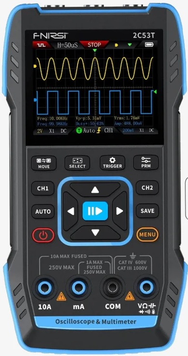

# OpenScope 2C53T

**Open-source replacement firmware for the FNIRSI 2C53T handheld oscilloscope / multimeter / signal generator.**

<p align="center">
  
</p>

The FNIRSI 2C53T is a capable $75 handheld 3-in-1 instrument held back by buggy stock firmware. This project is a complete clean-room firmware rewrite built from reverse engineering the original binary.

## Current Status

**Custom firmware runs on real hardware.** The UI, button input, battery management, and USB bootloader all work. Active development is focused on getting live oscilloscope data from the FPGA.

### Working on hardware today
- 4 navigable UI modes: oscilloscope, multimeter, signal generator, settings
- 4 color themes (Dark Blue, Classic Green, High Contrast, Night Red)
- Variable-width bitmap fonts at 4 sizes (12/16/24/48px)
- FreeRTOS with display + input tasks
- 14/15 button matrix scanning at 500Hz
- Battery monitor with percentage, USB charge detection, low-battery auto-off
- Soft power management (3-2-1 countdown shutdown)
- Watchdog and health monitoring
- USB HID bootloader for closed-case firmware updates
- FPGA USART communication (bidirectional, meter data flowing)

### Implemented, tested, awaiting real data
These algorithms are written and unit-tested, but currently run on demo waveforms. They'll come alive once FPGA ADC data flows through SPI3.

- FFT spectrum analyzer (4096-point, 5 window functions, averaging, max hold)
- Protocol decoders (UART, SPI, I2C, CAN, K-Line/KWP2000)
- Math channels (CH1+CH2, CH1-CH2, CH1*CH2, invert)
- Auto-measurements (frequency, Vpp, Vrms, duty cycle)
- Persistence display (5 decay modes)
- Bode plot engine (log sweep, gain/phase calculation)
- Signal generator (DDS, 4 waveforms)
- Component tester (resistor, capacitor, ESR, diode, continuity)
- XY mode, roll mode, trend plotting
- Mask/pass-fail testing
- Config save/load with checksum
- Screenshot capture (BMP)

### In progress
- **FPGA SPI3 data acquisition** — root cause identified (needs PB11 HIGH, full boot command sequence, queue-driven triggering). This is the critical path to a working oscilloscope.

## Hardware

| Component | Details |
|-----------|---------|
| **MCU** | Artery AT32F403A — ARM Cortex-M4F @ 240MHz, 1MB flash, 224KB SRAM |
| **Display** | ST7789V 320x240 RGB565 via 16-bit parallel bus (EXMC) |
| **FPGA** | Gowin GW1N-UV2 — handles 250MS/s ADC sampling |
| **ADC** | Dual-channel, 8-bit, 250MS/s via FPGA SPI3 |
| **Signal Gen** | 2-channel 12-bit DAC |
| **Flash** | Winbond W25Q128JVSQ (16MB) — UI assets and calibration |
| **Input** | 15 buttons (4x3 scanned matrix + 3 passive) |

> The MCU markings are sanded off. We identified it as AT32F403A through register probing — it's register-compatible with GD32/STM32F1 at the GPIO level.

## Getting Started

### Prerequisites

**Toolchain:**

```bash
# macOS (Homebrew)
brew install --cask gcc-arm-embedded    # ARM toolchain
brew install dfu-util                    # USB DFU flasher

# Linux (Debian/Ubuntu)
sudo apt install gcc-arm-none-eabi libnewlib-arm-none-eabi
sudo apt install dfu-util make

# Windows
# Install ARM GNU Toolchain from https://developer.arm.com/downloads/-/arm-gnu-toolchain-downloads
# Install dfu-util from https://dfu-util.sourceforge.net/
# Build with Make (via MSYS2, WSL, or similar)
```

**Dependencies (all platforms):**

The firmware depends on two libraries that aren't bundled in the repo. Clone them into the `firmware/` directory:

```bash
cd firmware
git clone https://github.com/ArteryTek/AT32F403A_407_Firmware_Library.git at32f403a_lib
git clone https://github.com/FreeRTOS/FreeRTOS-Kernel.git FreeRTOS
```

**Build once before flashing:**

```bash
cd firmware && make
```

This populates `firmware/build/` with `firmware.bin`, `bootloader.bin`, and `option_bytes48.bin` (a 48-byte blob used by the one-time option-byte DFU write below).

### First-Time Hardware Setup

The first flash requires opening the case to enter the AT32's **ROM DFU mode** — this is the only mode that can write option bytes. After the initial flash installs the USB HID bootloader, all future updates go over USB-C with the case closed.

> **Two bootloaders — don't confuse them.** *ROM DFU* (entered via BOOT0 + pinhole reset, LCD dark, `2e3c:df11`) is required for the one-time EOPB0 setup. The *USB HID bootloader* (Settings → Firmware Update, "BOOTLOADER MODE" on the LCD) handles every update after that but cannot write option bytes.

**See the full walkthrough with photos: [DFU Mode Guide](docs/dfu_mode_guide.md)**

The short version:

1. Open the case (6 Phillips screws on back)
2. Use a jumper wire to bridge 3.3V (from the SWD header near USB-C) to the BOOT0 pull-down resistor (MCU side, near the main chip)
3. While holding 3.3V on BOOT0, press the pinhole reset button, then release both
4. Verify ROM DFU: `dfu-util -l` should list `2e3c:df11` with alt interfaces 0 (Internal Flash) and 1 (Option Byte)
5. Set EOPB0 = 0xFE → 224KB SRAM mode (one-time):
   ```bash
   cd firmware
   dfu-util -a 1 -d 2e3c:df11 -s 0x1FFFF800 -D build/option_bytes48.bin
   ```
   Expect `Download done. / File downloaded successfully`. The `Invalid DFU suffix signature` and `Error sending dfu abort request` warnings are cosmetic.
6. Pinhole reset to stay in DFU, then flash the bootloader and application:
   ```bash
   make flash-all
   ```
7. Remove the BOOT0 jumper, pinhole reset, close the case — you won't need to open it again

### Normal Development Cycle (case closed)

Once the USB HID bootloader is installed, updates are simple:

1. On the device: **Settings > Firmware Update** (shows "BOOTLOADER MODE" screen)
2. On your computer:
   ```bash
   cd firmware && make flash
   ```
3. The device auto-reboots into the updated firmware

### Build

```bash
cd firmware
make              # Build for hardware (AT32 @ 240MHz)
make emu          # Build for emulator (skips hardware init)
```

### Emulator (no hardware required)

```bash
make renode              # Run in Renode with LCD display
make renode-interactive  # Run with keyboard input
```

Requires [Renode](https://renode.io/) at `/Applications/Renode.app`. An SDL3 native LCD viewer is also available (`brew install sdl3 && cd emulator && make`).

## Project Structure

```
firmware/               Custom replacement firmware (C + FreeRTOS + Make)
  src/main.c            Entry point, FreeRTOS tasks, mode switching
  src/drivers/          LCD, buttons, battery, watchdog, DFU boot
  src/ui/               Scope, meter, siggen, settings, themes
  src/dsp/              FFT, math channels, signal gen, Bode
  src/decode/           Protocol decoders (UART, SPI, I2C, CAN, K-Line)
  src/tasks/            Measurement engine, component tester, mask test
  bootloader/           USB HID IAP bootloader (16KB)

reverse_engineering/    Hardware analysis and protocol documentation
  ARCHITECTURE.md       System overview (start here for RE)
  HARDWARE_PINOUT.md    Complete MCU pin assignments
  FPGA_PROTOCOL_COMPLETE.md   Full FPGA command/data specification
  COVERAGE.md           309 functions mapped from stock firmware
  analysis_v120/        Detailed V1.2.0 analysis artifacts

emulator/               Renode platform + SDL3 LCD viewer
docs/                   Design docs, analysis, planning (see docs/README.md)
modules/                JSON procedure files (automotive, HVAC, ham radio)
scripts/                Font generation, flash tools, soak testing
```

## Documentation

Start with the [Documentation Index](docs/README.md). Key documents:

- [Architecture Overview](reverse_engineering/ARCHITECTURE.md) — How the hardware works
- [FPGA Protocol](reverse_engineering/FPGA_PROTOCOL_COMPLETE.md) — ADC sampling and command interface
- [Hardware Pinout](reverse_engineering/HARDWARE_PINOUT.md) — Every MCU pin mapped
- [Roadmap](docs/roadmap.md) — What's done, what's next, future plans

## Reverse Engineering

The stock firmware was reverse-engineered using [Ghidra](https://ghidra-sre.org/). We've identified and named 309 functions, mapped all ~40 FPGA commands, fully documented the ADC data format, and traced every hardware pin. About 98% of the stock firmware is now understood.

No FNIRSI source code is distributed in this repository. See [reverse_engineering/README.md](reverse_engineering/README.md) for methodology and legal basis.

## Contributing

Contributions are welcome! This is a solo-maintained project, so some areas are more open than others. See **[CONTRIBUTING.md](CONTRIBUTING.md)** for the full guide, including what's open, what needs discussion first, and how to submit.

**The most valuable things you can do right now:**
- **Test on your hardware** — different 2C53T units reveal things a single bench unit can't
- **Share logic analyzer captures** of FPGA communication on your unit
- **Contribute modules** (`modules/*.json`) for your domain (automotive, HVAC, ham radio, etc.)
- **Document what worked** — if you got a first-flash working on Linux or Windows, write it up
- **Translate** — we have users in Korea and Russia already; localization help is welcome

Bug reports and feature requests are always welcome via the issue tracker.

## Related Projects

- [pecostm32/FNIRSI-1013D-1014D-Hack](https://github.com/pecostm32/FNIRSI-1013D-1014D-Hack) — Schematics, datasheets, and FPGA docs for the 1013D/1014D
- [pecostm32/FNIRSI_1013D_Firmware](https://github.com/pecostm32/FNIRSI_1013D_Firmware) — Replacement firmware for the 1013D
- [Atlan4/Fnirsi1013D](https://github.com/Atlan4/Fnirsi1013D) — Most active FNIRSI firmware fork (471 commits)
- [Gissio/radpro](https://github.com/Gissio/radpro) — Custom firmware for FNIRSI Geiger counters

## License

[GNU General Public License v3.0](LICENSE)
