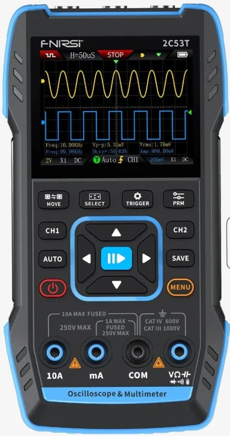

# OpenScope 2C53T

**Open-source replacement firmware for the FNIRSI 2C53T handheld oscilloscope / multimeter / signal generator.**

<p align="center">
  
</p>

The FNIRSI 2C53T is a capable $75 handheld 3-in-1 instrument held back by buggy stock firmware. This project is a complete clean-room firmware rewrite built from reverse engineering the original binary.

> **🎉 The oscilloscope captures.** As of **2026-08-13**, the `make guest-coldtrace` build cold-boots, configures the Gowin GW1N-UV2 FPGA itself, arms the capture engine, and renders live, probe-responsive waveforms — no stock firmware, no warm handoff, no opening the case. The FPGA configuration problem that owned this project's critical path from April to August is **solved**. [How to see it](#seeing-live-waveforms-today) · [the story](docs/devlog/2026-08-13-cold-boot-to-scope.md) · [issue #18](https://github.com/DavidClawson/OpenScope-2C53T/issues/18)

> ### ⚠️ This is development firmware — don't depend on it for real measurements
>
> **The scope captures, but it is not yet a *usable* instrument.** There is **no timebase control** — each hardware sweep is a ~microsecond, 1024-sample snapshot refreshed about 34 times a second, so the trace faithfully tracks slow signals as a moving level and anything above roughly 15 Hz aliases into nonsense. **Vertical calibration is a placeholder** — the baseline sits around 55 and the trace clips against the top of the plot. And the **measurement badges on the scope screen are hardcoded strings, not measurements** — they will show `1.00kHz` / `707mV` / `50.0%` no matter what you probe. It is a real oscilloscope with a vertical axis and no horizontal knob. If you need a working scope today, stay on stock.
>
> **The multimeter works, but treat it as unverified on your unit.** The decode is accurate within a few percent on our bench device, but the low-Ω calibration factor is *per-device* and currently hardcoded to that one unit — so absolute readings on your hardware have not been checked by anyone. **Use it alongside a known-good meter**, the way you would with any unfamiliar instrument, and don't trust it alone for anything that matters.
>
> Flash it to help develop it, to explore the hardware, or because the reverse engineering interests you. **PR #16 adds a dual-boot switcher** so you can keep stock and switch between them rather than choosing.

## Current Status

**Custom firmware runs on real hardware, and it captures.** On 2026-08-13, bench unit #1 powered on into this firmware, configured the FPGA over SSPI (status `0x00039020` → `0x0003F460`, `DONE_FINAL` set), armed the capture engine, and drew live traces from real ADC data on both channels — reproducibly across power cycles. Active development has moved from *getting data at all* to **timebase control and calibration**, i.e. making the captured data mean something.

### Seeing live waveforms today

Live capture lives in **one specific build target**. `make` and `make guest` do *not* configure the FPGA and will *not* capture — only `guest-coldtrace` runs the configuration path:

```bash
cd firmware && make guest-coldtrace
python3 ../scripts/iap_flash.py     # MENU + tap Power → upgrade mode → detect → flash
```

`guest-coldtrace` is a **guest image**: it links at `0x08007000` and runs under the FNIRSI *stock* IAP bootloader (the `MENU + Power` upgrade mode described [below](#restoring-stock-or-flashing-via-usb-c-macos--linux)), rather than under our HID bootloader. It still needs the one-time 224KB SRAM option byte from [First-Time Hardware Setup](#first-time-hardware-setup). Power-cycle the device, open scope mode, and probe something slow (a few Hz). The firmware ships a synthetic demo square wave as a fallback — **when the demo trace disappears, you are looking at real samples.**

Three caveats, stated plainly:

- It is a **scope-only experimental image**. It holds USART2 dark, which is what the multimeter runs on, so the meter is inactive in this build.
- It is validated on **one physical unit**. Nobody has run it on a second 2C53T.
- **It is not the default `make guest` boot path yet.** Folding it in is on the roadmap.

### Working on hardware today
- **Live oscilloscope capture from a cold boot** (`guest-coldtrace` build only) — MCU-driven FPGA configuration, engine arm, and per-channel `0x04`/`0x05` readout feeding the scope trace
- 4 navigable UI modes: oscilloscope, multimeter, signal generator, settings
- 4 color themes (Dark Blue, Classic Green, High Contrast, Night Red)
- Variable-width bitmap fonts at 4 sizes (12/16/24/48px)
- FreeRTOS with display + input tasks
- 15/15 button matrix scanning at 500Hz
- Battery monitor with percentage, USB charge detection, low-battery auto-off
- Soft power management (3-2-1 countdown shutdown)
- Watchdog and health monitoring
- USB HID bootloader for closed-case firmware updates
- FPGA USART communication (bidirectional, meter data flowing)

### Written but not usable yet — read this before getting excited

Capture starting to work on 2026-08-13 did **not** light up the feature list below. Nothing above the acquisition layer was ever wired to the ADC, so these split into two groups, and neither means "works".

**Reachable in the UI, but running on synthetic input.** You can navigate to these screens and they will draw something. What they draw is not your signal.

| Feature | What it's actually fed |
|---|---|
| FFT spectrum analyzer + waterfall | A synthetic 1 kHz square wave generated on the spot (`scope_ui.c:1295`, `:1477`) |
| Math channels (CH1+CH2, CH1−CH2, CH1×CH2, invert) | A hardcoded sine lookup table and square wave (`scope_ui.c:688`) |
| Bode plot | A generated demo response of a 1st-order low-pass (`bode_ui.c:45`) |
| Scope measurement badges (Freq / Vpp / Vrms / Duty / Period) | **Nothing — they are literal strings** (`scope_ui.c:266`) |

**Code exists with host tests, but has no call site in the firmware.** These are compiled and then garbage-collected out of the image. There is no way to reach them from the UI at all:

- Protocol decoders (UART, SPI, I2C, CAN, K-Line/KWP2000) — no call sites
- Auto-measurements — `measurement_compute()` has zero call sites
- Persistence, XY mode, roll mode, trend plotting, mask/pass-fail testing
- Screenshot capture (BMP) — no caller
- Config save/load with checksum — `config_save()` has no callers and writes to a **static RAM buffer** (`config.c:142`); the filesystem layer under it is still a stub, so **nothing persists across a power cycle**
- `modules/` is four empty directories. There is no schema, no loader, and no content.

The signal generator and component tester are reachable from the UI; their output has not been characterized against instruments, so treat them as unverified rather than working.

Wiring this layer to real acquisition is the work that follows timebase and calibration — the DSP is genuinely written and tested, it just has nothing real plugged into it.

### What does not work yet

- **Timebase — the main thread now.** The build never sets an FPGA sample rate, so every sweep is the same ~microsecond snapshot. Slow signals render as a moving level; a 1 Hz square is crisp, a 2 Hz sine stair-steps, 50 Hz and up freezes to a stuck level. Netlist analysis of the stock bitstream says there is **no rate-control register in the capture path at all**, which points the fix at MCU-side read pacing rather than an FPGA divisor — that is the current investigation.
- **⚠️ The measurement badges on the scope screen are fake.** Freq, Vpp, Vrms, Duty and Period render as fixed strings — `1.00kHz`, `707mV`, `50.0%`, `1.00ms` — hardcoded at `scope_ui.c:266`. They look exactly like live measurements and they are not connected to anything. `measurement_compute()` exists, is tested, and is never called. **Do not read a number off the scope screen and believe it.**
- **Per-range vertical calibration is a placeholder.** Baseline ~55, trace clips at the top of the plot. Needs known signals at known amplitudes on a bench, which is a maintainer-only task.
- **CH2's trigger reference is decoded but unverified.** Stock drives it from a TMR13 CH1 PWM-DAC on PA6 (`C1DT @ 0x40001C34`), which our firmware historically never programmed. The bring-up exists behind `make guest-warmtest-ch2` and PA6's identity has not been confirmed on hardware, so treat CH2 triggering as unproven.
- **Only the bit-banged configuration path works.** Config succeeds when the SSPI handshake is bit-banged on GPIO; the same bytes through the SPI3 hardware peripheral still get silently discarded (`0x00039020`, `DONE_FINAL` clear). We ran the obvious single-variable test on 2026-08-13 — the `0x05` ERASE_SRAM frame that the two paths disagree about — and **it made no difference**, so the cause is somewhere in our SPI3 setup or framing, not the prelude contents. Stock configures the same part over hardware SPI, so this is a real unexplained gap and not a property of the peripheral.
- **Rendering is slow in places.** The FFT waterfall repaints by issuing one fill per pixel column (20,480 draw calls per frame) and visibly rasters across the screen; the scope and signal-generator screens still repaint unconditionally rather than on change. A rendering pass is queued.
- **The USB CDC debug shell does not enumerate on every build.** On our bench unit it correlates exactly with which configuration path the image uses, but the mechanism is unestablished. It is a diagnostic channel, not a user feature, and the LCD debug overlay covers the same ground.

The story of how we got here — including the six weeks lost to a mis-clocked register read, and the several confident hypotheses that turned out to be wrong — is in the [devlog](docs/devlog/).

## Hardware

| Component | Details |
|-----------|---------|
| **MCU** | Artery AT32F403A — ARM Cortex-M4F @ 240MHz, 1MB flash, 224KB SRAM |
| **Display** | ST7789V 320x240 RGB565 via 16-bit parallel bus (EXMC) |
| **FPGA** | Gowin GW1N-UV2 — handles 250MS/s ADC sampling |
| **ADC** | Dual-channel, 8-bit, 250MS/s via FPGA SPI3 |
| **Signal Gen** | 2-channel 12-bit DAC |
| **Flash** | Winbond W25Q128JVSQ (16MB) — UI assets and calibration |
| **Input** | 15 buttons (4x3 scanned matrix + 3 passive) |

> The MCU markings are sanded off. We identified it as AT32F403A through register probing — it's register-compatible with GD32/STM32F1 at the GPIO level.

## Getting Started

### Prerequisites

**Toolchain:**

```bash
# macOS (Homebrew)
brew install --cask gcc-arm-embedded    # ARM toolchain
brew install dfu-util                    # USB DFU flasher

# Linux (Debian/Ubuntu)
sudo apt install gcc-arm-none-eabi libnewlib-arm-none-eabi
sudo apt install dfu-util make

# Windows
# Install ARM GNU Toolchain from https://developer.arm.com/downloads/-/arm-gnu-toolchain-downloads
# Install dfu-util from https://dfu-util.sourceforge.net/
# Build with Make (via MSYS2, WSL, or similar)
```

**Dependencies (all platforms):**

The firmware depends on two libraries that aren't bundled in the repo. Clone them into the `firmware/` directory:

```bash
cd firmware
git clone https://github.com/ArteryTek/AT32F403A_407_Firmware_Library.git at32f403a_lib
git clone https://github.com/FreeRTOS/FreeRTOS-Kernel.git FreeRTOS
```

**Build once before flashing:**

```bash
cd firmware && make
```

This populates `firmware/build/` with `firmware.bin` (the application) and `option_bytes48.bin` (a 48-byte blob used by the one-time option-byte DFU write below).

> **`bootloader.bin` is built separately.** Plain `make` only builds the application. The USB HID bootloader is a separate target — run `make bootloader` to build it (output lands in `bootloader/build/bootloader.bin`). The first-time `make flash-all` step below builds it for you automatically, so you normally don't need to run `make bootloader` by hand.

### First-Time Hardware Setup

The first flash requires opening the case to enter the AT32's **ROM DFU mode** — this is the only mode that can write option bytes. After the initial flash installs the USB HID bootloader, all future updates go over USB-C with the case closed.

> **Two bootloaders — don't confuse them.** *ROM DFU* (entered via BOOT0 + pinhole reset, LCD dark, `2e3c:df11`) is required for the one-time EOPB0 setup. The *USB HID bootloader* (Settings → Firmware Update, or POWER+PRM during reset, "BOOTLOADER MODE" on the LCD) handles every update after that but cannot write option bytes.

**See the full walkthrough with photos: [DFU Mode Guide](docs/dfu_mode_guide.md)**

> **Windows users:** community member [@baraa1936](https://github.com/baraa1936) wrote a screenshot-by-screenshot walkthrough for flashing from Windows using the Artery ISP GUI tool (including the EOPB0 / 224KB SRAM option-byte step) — see [issue #20](https://github.com/DavidClawson/OpenScope-2C53T/issues/20).

The short version:

1. Open the case (6 Phillips screws on back)
2. Use a jumper wire to bridge 3.3V (from the SWD header near USB-C) to the BOOT0 pull-down resistor (MCU side, near the main chip)
3. While holding 3.3V on BOOT0, press the pinhole reset button, then release both
4. Verify ROM DFU: `dfu-util -l` should list `2e3c:df11` with alt interfaces 0 (Internal Flash) and 1 (Option Byte)
5. Set EOPB0 = 0xFE → 224KB SRAM mode (one-time):
   ```bash
   cd firmware
   dfu-util -a 1 -d 2e3c:df11 -s 0x1FFFF800 -D build/option_bytes48.bin
   ```
   Expect `Download done. / File downloaded successfully`. The `Invalid DFU suffix signature` and `Error sending dfu abort request` warnings are cosmetic.
6. Pinhole reset to stay in DFU, then flash the bootloader and application:
   ```bash
   make flash-all
   ```
   If the application write finishes but the device does not come up running the
   app, do not assume it booted. Remove the BOOT0 jumper, reset into the USB HID
   bootloader, and run `make flash` to install the application through the
   bootloader.
7. Remove the BOOT0 jumper, pinhole reset, close the case — you won't need to open it again once the application boots

### Normal Development Cycle (case closed)

Once the USB HID bootloader is installed, updates are simple:

1. On the device: **Settings > Firmware Update** (shows "BOOTLOADER MODE" screen)
2. On your computer:
   ```bash
   cd firmware && make flash
   ```
3. The device auto-reboots into the updated firmware

If the app image is invalid or will not boot, reset while holding **POWER+PRM**
to force the HID bootloader. POWER alone remains the normal battery power-on
gesture.

### Restoring Stock or Flashing via USB-C (macOS & Linux)

The device's **stock bootloader** also accepts firmware over USB-C — handy for restoring the original FNIRSI firmware or flashing without the HID bootloader. Hold **MENU + tap Power** to enter upgrade mode (the LCD shows "firmware upgrade"); the device mounts a FAT12 volume named `IAP`.

> **macOS users:** do **not** drag-drop the `.bin` in Finder — macOS's FAT driver corrupts the write (the volume uses 2048-byte sectors and Finder adds AppleDouble `._` junk the bootloader misreads as firmware). Use the bundled flasher, which writes the device correctly:

```bash
brew install mtools                  # one-time (Linux: sudo apt install mtools)
python3 scripts/iap_flash.py         # detect device → pick firmware → flash
```

It auto-detects the device and available images, verifies the stock firmware by SHA-256, and shows a progress bar. Subcommands: `status`, `list`, `flash <path>`, `doctor` (prerequisite check), `guide` (full walkthrough). A bad flash is never a brick — re-enter upgrade mode and reflash any image.

**Windows** users can skip the tool — drag-drop the `.bin` onto the `IAP` drive (the official FNIRSI method; Windows' FAT driver handles the volume cleanly).

### Build

```bash
cd firmware
make              # Build for hardware (AT32 @ 240MHz), for our HID bootloader — no FPGA config
make guest        # Guest image at 0x08007000, stock IAP bootloader — no FPGA config
make guest-coldtrace   # The one that captures: cold FPGA config + engine arm + live readout
make emu          # Build for emulator (skips hardware init)
```

**`guest-coldtrace` is the only build that configures the FPGA and captures** — see [Seeing live waveforms today](#seeing-live-waveforms-today). `make` and `make guest` produce a working UI with a synthetic demo trace and no acquisition. The `guest-*` family is flashed with `python3 scripts/iap_flash.py` rather than `make flash`.

### Emulator (no hardware required)

```bash
make renode              # Run in Renode with LCD display
make renode-interactive  # Run with keyboard input
```

Requires [Renode](https://renode.io/) (the Makefile looks for `/Applications/Renode.app` on macOS; set `RENODE` to override). An SDL3 native LCD viewer is also available (`brew install sdl3 && cd emulator && make`).

## Project Structure

```
firmware/               Custom replacement firmware (C + FreeRTOS + Make)
  src/main.c            Entry point, FreeRTOS tasks, mode switching
  src/drivers/          LCD, buttons, battery, watchdog, DFU boot
  src/ui/               Scope, meter, siggen, settings, themes
  src/dsp/              FFT, math channels, signal gen, Bode
  src/decode/           Protocol decoders (UART, SPI, I2C, CAN, K-Line)
  src/tasks/            Measurement engine, component tester, mask test
  bootloader/           USB HID IAP bootloader (16KB)

reverse_engineering/    Hardware analysis and protocol documentation
  ARCHITECTURE.md       System overview (start here for RE)
  HARDWARE_PINOUT.md    Complete MCU pin assignments
  FPGA_PROTOCOL_COMPLETE.md   Full FPGA command/data specification
  COVERAGE.md           309 functions mapped from stock firmware
  analysis_v120/        Detailed V1.2.0 analysis artifacts

emulator/               Renode platform + SDL3 LCD viewer
docs/                   Design docs, analysis, planning (see docs/README.md)
modules/                JSON procedure files (automotive, HVAC, ham radio)
scripts/                Font generation, flash tools, soak testing
```

## Documentation

Start with the [Documentation Index](docs/README.md). Key documents:

- [Architecture Overview](reverse_engineering/ARCHITECTURE.md) — How the hardware works
- [FPGA Protocol](reverse_engineering/FPGA_PROTOCOL_COMPLETE.md) — ADC sampling and command interface
- [Hardware Pinout](reverse_engineering/HARDWARE_PINOUT.md) — Every MCU pin mapped
- [Roadmap](docs/roadmap.md) — What's done, what's next, future plans
- [Devlog](docs/devlog/) — Dated notes on what we tried, including the wrong turns

## Reverse Engineering

The stock firmware was reverse-engineered using [Ghidra](https://ghidra-sre.org/). We've identified and named 309 functions, mapped all ~40 FPGA commands, fully documented the ADC data format, and traced every hardware pin. About 98% of the stock firmware is now understood.

No FNIRSI source code is distributed in this repository. See [reverse_engineering/README.md](reverse_engineering/README.md) for methodology and legal basis.

## Help Wanted

The UI shell is built out and acquisition now works, but almost nothing in between is connected — and the next milestones need hardware captures and experimentation that a single bench unit can't provide. **You don't need to write code to make a big contribution here** (though wiring the DSP layer to real samples is a well-defined job for someone who does).

### 1. ~~Logic analyzer captures of the stock firmware boot sequence~~ ✅ DONE
**Capture obtained June 2026** thanks to @maksidze ([issue #18](https://github.com/DavidClawson/OpenScope-2C53T/issues/18)), who patched the stock firmware's SPI prescaler to /64 and captured a full stock boot on a Saleae. That capture revealed our FPGA bitstream was extracted from the wrong file offset (we'd treated the flash address as a file offset, ignoring the `0x08007000` link base — the real bitstream is at file offset `0x4AD19`). The corrected bitstream is byte-exact against the capture. Full decode: [`reverse_engineering/captures/`](reverse_engineering/captures/).

**It did not fix FPGA configuration on its own** — but it was worth every minute: it eliminated the payload as a variable, which is what let us state the problem as config *entry* rather than config *content*, and maksidze's loader is the one that eventually broke the wall (see below).

### 2. ~~Gowin FPGA configuration~~ ✅ SOLVED — by two people in this issue tracker
For four months a GW1N-UV2 that had auto-booted its own resident design answered every SSPI query we sent and silently discarded every configuration command. On **2026-08-12**, [@Stlkv](https://github.com/Stlkv) transplanted @maksidze's 2C23T loader — which **bit-bangs** the SSPI handshake on GPIO instead of using the SPI peripheral — onto the 2C53T's pins with our corrected payload, and the part configured on the first cold boot. We reproduced it on our bench the next day and reached cold-boot-to-live-trace. [Issue #18](https://github.com/DavidClawson/OpenScope-2C53T/issues/18) is the thread; the [devlog entry](docs/devlog/2026-08-13-cold-boot-to-scope.md) is the story.

**Still genuinely open, if Gowin internals are your thing:** why the *hardware-SPI* path fails when the identical bytes bit-banged succeed — and when stock configures the same part over hardware SPI. We eliminated the obvious prelude difference (`0x05` ERASE_SRAM) by direct test.

### 3. Timebase and acquisition timing — the new highest-value ask
Capture works; making it display a waveform does not. Analysis of the stock bitstream's netlist says there is **no sample-rate register in the FPGA's capture path** — every write enable and address-counter clock enable is tied high — which means the timebase must be MCU-side pacing, and stock's pacer looks like TMR3 with a 9-entry 1-2-5 period table. If you have a 2C53T and a logic analyzer, captures of stock's **runtime** command traffic while sweeping the timebase knob (it rides on USART, which the boot-time SPI capture couldn't see) would settle this quickly. See [FPGA Protocol](reverse_engineering/FPGA_PROTOCOL_COMPLETE.md) for the command table.

### 4. Board variant documentation
We've confirmed one board revision (V1.4) and one user has reported a different layout with no version marking. If your 2C53T looks different from [our photos](docs/images/), photos of your PCB (top and bottom) are extremely valuable — especially near the FPGA, SPI flash, and analog frontend.

### 5. Everything else
- **Test on your hardware** — different units reveal things a single bench unit can't
- **Document what worked** — first-flash walkthroughs for Linux or Windows are always welcome
- **Contribute modules** (`modules/*.json`) for your domain (automotive, HVAC, ham radio, etc.)
- **Translate** — we have users in Korea and Russia already; localization help is welcome

See **[CONTRIBUTING.md](CONTRIBUTING.md)** for the full guide. Bug reports and feature requests are always welcome via the [issue tracker](https://github.com/DavidClawson/OpenScope-2C53T/issues).

## Related Projects

- [pecostm32/FNIRSI-1013D-1014D-Hack](https://github.com/pecostm32/FNIRSI-1013D-1014D-Hack) — Schematics, datasheets, and FPGA docs for the 1013D/1014D
- [pecostm32/FNIRSI_1013D_Firmware](https://github.com/pecostm32/FNIRSI_1013D_Firmware) — Replacement firmware for the 1013D
- [Atlan4/Fnirsi1013D](https://github.com/Atlan4/Fnirsi1013D) — Most active FNIRSI firmware fork (471 commits)
- [Gissio/radpro](https://github.com/Gissio/radpro) — Custom firmware for FNIRSI Geiger counters

## License

[GNU General Public License v3.0](LICENSE)
