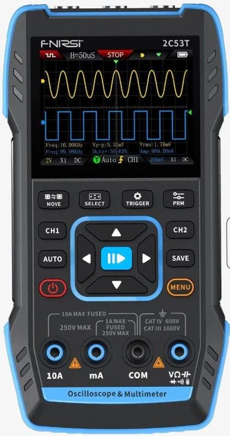
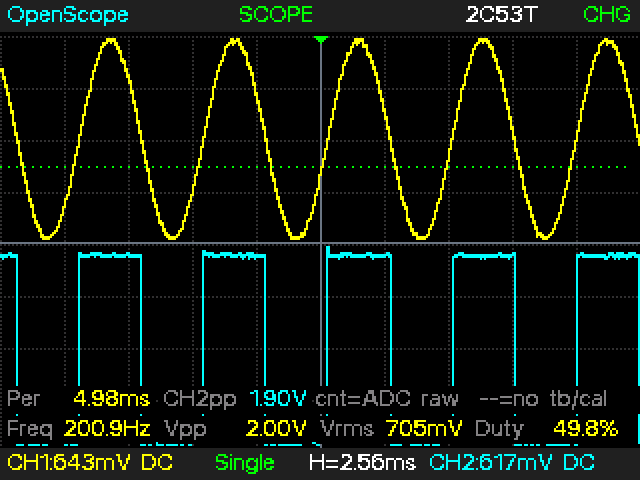
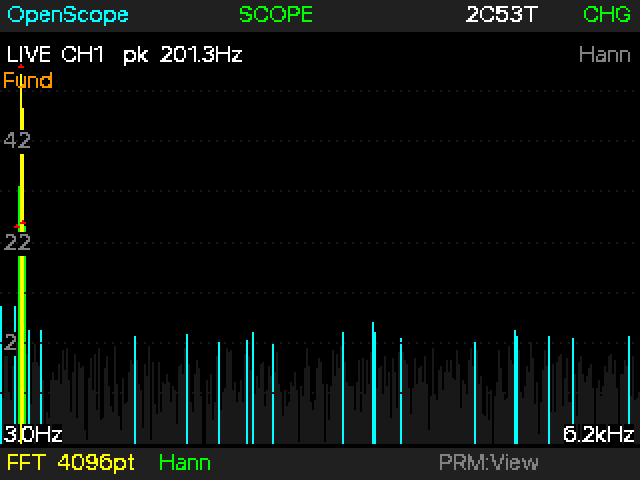
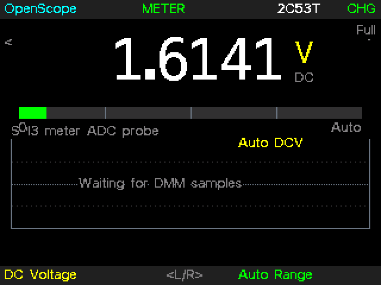

# OpenScope 2C53T

**Open-source replacement firmware for the FNIRSI 2C53T handheld oscilloscope / multimeter / signal generator.**

<p align="center">
  
</p>

The FNIRSI 2C53T is a capable $75 handheld 3-in-1 instrument held back by buggy stock firmware. This project is a complete clean-room firmware rewrite built from reverse engineering the original binary.

> ### 🛑 This firmware is for the FNIRSI **2C53T** only
>
> **Do not flash it to a 2C23T, a 2C53P, or any other FNIRSI model.** The boards are close relatives but not interchangeable: different pin assignments, different FPGA transport, different application base address, and a different factory bootloader. Flashing this to the wrong model will not work and, if you follow Path B of [First-Time Hardware Setup](#first-time-hardware-setup), it will overwrite that device's factory bootloader with one built for the 2C53T. (Path A, the `guest` images, leaves the bootloader alone, but is still built for the 2C53T's hardware and not for any other model.)
>
> - **FNIRSI 2C23T** → use [rosenrot00/OpenScope-2C23T](https://github.com/rosenrot00/OpenScope-2C23T), which is written for that hardware.
> - **Anything else** → there is no open firmware for it yet. Please don't experiment with this one.
>
> Check the model printed on the back of your unit before you start. If you have already flashed the wrong device, open an issue — the AT32's ROM DFU mode is unerasable mask ROM, so recovery is almost always possible.

> **🎉 The oscilloscope captures.** As of **2026-08-13**, the `make guest-coldtrace` build cold-boots, configures the Gowin GW1N-UV2 FPGA itself, arms the capture engine, and renders live, probe-responsive waveforms — no stock firmware, no warm handoff, no opening the case. The FPGA configuration problem that owned this project's critical path from April to August is **solved**. [How to see it](#seeing-live-waveforms-today) · [the story](docs/devlog/2026-08-13-cold-boot-to-scope.md) · [issue #18](https://github.com/DavidClawson/OpenScope-2C53T/issues/18)

> ### ⚠️ This is development firmware — don't depend on it for real measurements
>
> **Back up your factory calibration before your first flash.** Every unit carries its own calibration in one 4 KB page of MCU flash (`0x08006000`), and OpenScope images overwrite it. Nothing we hold can regenerate it ([#28](https://github.com/DavidClawson/OpenScope-2C53T/issues/28)). It is a one-time step of a few minutes, and it cannot be done after the fact: [how](#back-up-your-factory-calibration-first).
>
> **The scope captures, and both axes now carry measured numbers — but it is validated on one physical unit.** Timebase control reaches the hardware and 8 of 21 rate codes are bench-measured; the rest display `--` rather than a guess. Vertical ranges 5/6/7 are measured and cross-validated four ways, 4/8/9 are provisional and marked `~`, and 0–3 rail and fall back to honest ADC counts. The measurement badges are real measurements, not placeholders. What is *not* settled: **absolute vertical scale** traces to a bench source never checked against a reference (the error is uniform and recoverable with one constant), the **vertical graticule autoscales by default** so a division does not mean the printed volts/div, **CH2 has one usable attenuator tap**, and the acquisition record carries stale data at its edges. If you need a scope you can trust unsupervised today, stay on stock.
>
> **The multimeter works, but treat it as unverified on your unit.** The decode is accurate within a few percent on our bench device, but the low-Ω calibration factor is *per-device* and currently hardcoded to that one unit — so absolute readings on your hardware have not been checked by anyone. **Use it alongside a known-good meter**, the way you would with any unfamiliar instrument, and don't trust it alone for anything that matters.
>
> Flash it to help develop it, to explore the hardware, or because the reverse engineering interests you. **PR #16 adds a dual-boot switcher** so you can keep stock and switch between them rather than choosing.

## Current Status

**Custom firmware runs on real hardware, and it captures.** On 2026-08-13, bench unit #1 powered on into this firmware, configured the FPGA over SSPI (status `0x00039020` → `0x0003F460`, `DONE_FINAL` set), armed the capture engine, and drew live traces from real ADC data on both channels — reproducibly across power cycles. Both axes now carry measured numbers: per-range volts/div on both channels (2026-08-18) and eight measured sample rates on the timebase ladder (2026-08-19), each cross-checked against an independent rig. Active development has moved to **wiring the layer above acquisition**: as of v0.4.0 (2026-09-30) triggering is fully usable from the buttons, captures are time-ordered with the trigger mid-record, and the FFT analyses live data. The measurement badges and the FFT read from real captures; math channels and protocol decoders are still written, host-tested, and fed synthetic input.

### What it looks like

Captured from bench unit #1 running v0.4.0, over USB with `scripts/screenshot.py`. These are the device's own framebuffer, not mock-ups; colours are rounded to the firmware's 16-colour screenshot palette.

| Scope, SINGLE: CH1 sine, CH2 square, trigger at mid-screen | FFT on the live capture | Multimeter, DC volts |
|---|---|---|
|  |  |  |

### Seeing live waveforms today

> **Before the first flash, back up your factory calibration** — [how](#back-up-your-factory-calibration-first). The image below overwrites the page that holds it, and a copy cannot be made afterwards.

Live capture lives in **one specific build target**. `make` and `make guest` do *not* configure the FPGA and will *not* capture — only `guest-coldtrace` runs the configuration path:

```bash
cd firmware && make guest-coldtrace
python3 ../scripts/iap_flash.py     # MENU + tap Power → upgrade mode → detect → flash
```

`guest-coldtrace` is a **guest image**: it links at `0x08007000` and runs under the FNIRSI *stock* IAP bootloader (the `MENU + Power` upgrade mode described [below](#restoring-stock-or-flashing-via-usb-c-macos--linux)), rather than under our HID bootloader. It flashes with the case closed and never touches the factory bootloader. The 224 KB SRAM option byte it needs is already set on any unit that has ever booted FNIRSI's own firmware, so ROM DFU is not needed in the usual case — see Path A in [First-Time Hardware Setup](#first-time-hardware-setup). Power-cycle the device, open scope mode, and probe something slow (a few Hz). The firmware ships a synthetic demo square wave as a fallback — **when the demo trace disappears, you are looking at real samples.**

Three caveats, stated plainly:

- The **multimeter in this image reads DC Voltage only**, alongside the scope (EXP-23). It runs the meter chip's own auto mode. The fix for the other functions — [@Stlkv](https://github.com/Stlkv)'s corrected command header and display decoder ([#33](https://github.com/DavidClawson/OpenScope-2C53T/pull/33), [#35](https://github.com/DavidClawson/OpenScope-2C53T/pull/35)) — builds as `guest-coldtrace-meter`, tested on his unit, and becomes the default once validated on ours.
- It is validated on **one physical unit**. Nobody has run it on a second 2C53T.
- **It is not the default `make guest` boot path yet.** Folding it in is on the roadmap.

### Working on hardware today

The short version; see [Feature maturity](#feature-maturity) below for how far each one has actually been taken.

- **Live oscilloscope capture from a cold boot** (`guest-coldtrace` only) — MCU-driven FPGA configuration, engine arm, and per-channel `0x04`/`0x05` readout
- **Measured volts/div and time/div**, with uncalibrated ranges labelled `--` rather than guessed
- **Triggering from the buttons**: AUTO/NORMAL/SINGLE, level, Rising/Falling, and horizontal position with pre-trigger capture (v0.4.0)
- **FFT and waterfall on the live capture**
- 4 navigable UI modes: oscilloscope, multimeter, signal generator, settings
- 4 color themes, variable-width bitmap fonts at 4 sizes
- FreeRTOS with display + input tasks; 15/15 button matrix at 500 Hz
- Settings that survive a power cycle, to external flash
- Battery monitor, soft power management, watchdog and health monitoring
- USB HID bootloader for closed-case firmware updates
- FPGA USART communication (meter data flowing — but not in the capture build)

### Feature maturity

Every feature sits at one of five stages. The stages are cumulative, and the
last two exist because this project has repeatedly shipped a number that was
plausible, stable and wrong.

| | Stage | What it means |
|---|---|---|
| **S0** | Written | Code and host tests exist. Nothing on the device reaches it — it is compiled and garbage-collected out of the image, or it draws from a synthetic source. |
| **S1** | Wired | Reachable on the device and fed by real hardware data. |
| **S2** | Measured | Checked on the bench against a known input, with the number and the method written up in [`docs/experiments/`](docs/experiments/). |
| **S3** | Guarded | A regression test would catch it breaking — ideally with a negative control, or data held out from whatever was tuned. |
| **S4** | Polished | The UX has been considered: legible, responsive, and honest when it cannot answer. |

Nothing is at S4 yet. This table is the backward-looking half — where each
feature stands. The forward half — what would promote each one, and what
should exist that doesn't — lives in [`docs/specs/`](docs/specs/), one
reviewable promotion-ladder spec per feature.

| Feature | Stage | Where it actually stands |
|---|---|---|
| Cold-boot FPGA configuration | **S2** | Bit-banged SSPI only. The same bytes through the SPI3 peripheral are still silently discarded. |
| Live capture, CH1 | **S2** | Reproducible across power cycles on one unit. |
| Live capture, CH2 | **S2** | Armed at boot in `guest-coldtrace` (EXP-38): a fresh boot reads CH2's own tone beside CH1's, no shell command. The CH2 attenuator ladder has not been re-measured since arming. |
| Vertical scale (volts/div) | **S3** | Ranges 5/6/7 measured and cross-validated four ways; 4/8/9 provisional and marked `~`; 0–3 rail and return `0.0`, with callers falling back to ADC counts. **Absolute scale is unverified** — every gain traces to an amplitude commanded from an unchecked source. One constant fixes it when a trusted source arrives. |
| Horizontal scale (time/div) | **S3** | 8 of 21 timebase codes measured; the rest show `--` rather than a guess. The UI button reaches the FPGA as of 2026-08-19 — before that it moved a label and nothing else. |
| Freq badge | **S3** | Spectral, with a held-out fixture and a bin-stratified assertion. Refuses on torn records instead of guessing; answers ~87% of bench captures and has never been wrong on them. |
| Vpp / Vrms / Period badges | **S2** | Bench-validated against a commanded sine, 3 ranges × 2 codes (EXP-19, 2026-08-20): Vrms within 3.8%, frequency-derived Period within 0.2%, Vpp within 7% with a small residual positive bias (peak detection reads high on a noisy record even after percentile trimming — Vrms is the number to trust). Same-source circularity means this is pipeline+linearity, not absolute volts. Duty passed its host battery but has not faced a commanded duty cycle yet. |
| Trigger level | **S2** | Digital, SPI3 register `0x08`. The comparator fires at code − 28 on ranges 5 and 7 alike (EXP-56). Set from the device: **MOVE** hands **UP/DOWN** to the level, and the marker sits where the hardware fires (bench-checked on unit #1). |
| Trigger modes, edge, position | **S2** | AUTO / NORMAL / SINGLE, Rising / Falling (a firmware filter — the FPGA fires on both edges, EXP-55), and horizontal position (**MOVE** twice, **LEFT/RIGHT**; trigger at mid-screen by default). Captures are time-ordered with the trigger in the middle. Guarded by `scripts/exp22_stability.py --trigger-only`, 21 scenarios with negative controls. |
| Settings persistence | **S2** | Commissioned on hardware 2026-08-20: first record ever written to the W25Q, then restored — and pushed into the FPGA — across three consecutive power cycles. Until that day every write was refused by a build-time interlock (`SETTINGS_PERSIST_WRITES=0`) no bench build had ever enabled, so this row previously said "real" while zero records existed — the matrix's first *over*statement. **Documented gap** (still true): a change carries only if a later button press or an orderly power-off follows it. |
| Multimeter | **S1** | In `guest-coldtrace` (the release image) the meter runs its own auto mode and reads **DC volts** alongside the scope; other functions do nothing yet. The command-header fix and the display decoder (@Stlkv, #33/#35) drive all functions in `guest-coldtrace-meter`, tested on a second unit, not yet on ours. |
| Signal generator | **S1** | Reachable; output has never been characterised against an instrument. |
| Screenshot capture (BMP) | **S1** | Has a call site and writes to flash. |
| Rendering path | **S3** | Flicker-free column compositor with a redraw gate. Display stability is bench-measured through the real render path (EXP-22, 2026-09-03): both channels driven, amplitude/frequency/phase varied, 11/11 scenarios lock to ≤1 px, with an on-hardware negative control that correctly fails. The scope trace **autoscales** to fill the band, so the vertical graticule does not currently mean the volts/div the status bar prints — that is the remaining S4 item. |
| FFT spectrum + waterfall | **S2** | Analyses the live capture (2026-09-22): peak bins exact at three measured timebases, header in Hz on measured codes and refused elsewhere, labels legible on the screen. Whole-record input is time-ordered since v0.4.0. |
| Math channels | **S0** | Fed a hardcoded sine LUT and square wave. |
| Bode plot | **S0** | A generated demo response of a first-order low-pass. |
| Protocol decoders (UART/SPI/I2C/CAN/K-Line) | **S0** | No call sites. |
| Auto-measurements engine (`measurement_compute`) | **S0** | Still has no caller — superseded by `scope_measure.c`, which drives the badges above. Its one unique quantity (rise/fall time) is unwired; the rest is scheduled for deletion (see the spec). |
| XY / roll / trend / mask testing | **S0** | No call sites. |
| `modules/` | **S0** | 17 guided-procedure files across four trades, with a provisional schema ([`modules/README.md`](modules/README.md)) — but no loader: nothing in the firmware reads them. |

### Sharp edges — read before trusting the screen

- **By default the vertical graticule is not the volts/div label.** The renderer autoscales every frame from the buffer's own min/max, a deliberate choice from when we had no measured gains and no offset control. The volts/div in the status bar is now genuinely measured, so the two disagree. An opt-in true-scale path (`fpga scope graticule true`) draws at a fixed counts/division so one division means the printed volts/div on calibrated ranges — default off (it needs a centred baseline) and not yet eyeballed on the bench.
- **Absolute vertical scale is uncalibrated.** All gains are relative to a bench source that has never been checked against a reference. Any error is uniform and recoverable with one constant.
- **Only the bit-banged configuration path works.** Stock configures the same part over hardware SPI, so this is an unexplained gap, not a property of the peripheral.
- **The USB CDC debug shell does not enumerate on every build.** It correlates exactly with which configuration path the image uses; the mechanism is unestablished. It is a diagnostic channel, not a user feature.

The story of how we got here — including the six weeks lost to a mis-clocked register read, and the several confident hypotheses that turned out to be wrong — is in the [devlog](docs/devlog/).

## Hardware

| Component | Details |
|-----------|---------|
| **MCU** | Artery AT32F403A — ARM Cortex-M4F @ 240MHz, 1MB flash, 224KB SRAM |
| **Display** | ST7789V 320x240 RGB565 via 16-bit parallel bus (EXMC) |
| **FPGA** | Gowin GW1N-UV2 — handles 250MS/s ADC sampling |
| **ADC** | Dual-channel, 8-bit, 250MS/s via FPGA SPI3 |
| **Signal Gen** | 2-channel 12-bit DAC |
| **Flash** | Winbond W25Q128JVSQ (16MB) — UI assets and calibration |
| **Input** | 15 buttons (4x3 scanned matrix + 3 passive) |

> The MCU markings are sanded off. We identified it as AT32F403A through register probing — it's register-compatible with GD32/STM32F1 at the GPIO level.

## Getting Started

### Back up your factory calibration first

Do this once per unit, before the first OpenScope flash. It cannot be done afterwards.

Each 2C53T carries its own calibration in one 4 KB page of MCU flash, `0x08006000`–`0x08006FFF`. The values are per unit: 127 of the 256 calibration bytes differ between a pristine V1.4 unit and bench unit #1, and the three units compared in [`archive/factory_cal/`](archive/factory_cal/README.md) differ pairwise across the whole block ([#28](https://github.com/DavidClawson/OpenScope-2C53T/issues/28)). No firmware we hold computes the values, so a page that is lost has nothing to be restored from. The v0.4.0 release notes state that OpenScope images overwrite it.

Two kinds of backup, and only one of them restores:

| What you keep | Can you write it back? |
|---|---|
| Photos of the LCD and the CRC32 that the release `caldump` image shows | No. The CRC32 lets you check that a restored page matches; the photos are a record. |
| A 4096-byte dump of the page ([PR #41](https://github.com/DavidClawson/OpenScope-2C53T/pull/41): `caldump`, then `mem read 0x08006000 1024` over the shell; the `mem read` command itself is already on `main` and prints 32-bit words as hex text, which you convert to a 4096-byte binary file) | Yes, byte for byte, with the ROM DFU command below. |

Steps, before you flash anything else:

1. Enter upgrade mode: **MENU + tap Power**. The unit mounts a drive named `IAP`.
2. Flash the release asset `openscope-2c53t-v0.4.0-caldump.bin` (`python3 scripts/iap_flash.py flash <path>`, or drag it onto the `IAP` drive on Windows). It is read-only: it writes nothing, it only reports the page.
3. The unit reboots into it. Photograph the screen and write down the CRC32. If you can run PR #41's `caldump` and `mem read 0x08006000 1024`, save the 4096 bytes too — that is the copy you can restore from.
4. Re-enter upgrade mode and flash the scope image.

To put your own page back later, enter ROM DFU (open case, BOOT0 + pinhole reset; see the [DFU Mode Guide](docs/dfu_mode_guide.md)) and run:

```bash
dfu-util -a 0 -d 2e3c:df11 -s 0x08006000 -D <your-caldump.bin>
```

where `<your-caldump.bin>` is the 4096-byte file from step 3. The recovery recipe in the DFU guide needs this step: the archived factory bootloader carries unit #1's page and overwrites yours ([#38](https://github.com/DavidClawson/OpenScope-2C53T/issues/38)).

### Prerequisites

**Toolchain:**

```bash
# macOS (Homebrew)
brew install --cask gcc-arm-embedded    # ARM toolchain
brew install dfu-util                    # USB DFU flasher

# Linux (Debian/Ubuntu)
sudo apt install gcc-arm-none-eabi libnewlib-arm-none-eabi
sudo apt install dfu-util make

# Windows
# Install ARM GNU Toolchain from https://developer.arm.com/downloads/-/arm-gnu-toolchain-downloads
# Install dfu-util from https://dfu-util.sourceforge.net/
# Build with Make (via MSYS2, WSL, or similar)
```

**Dependencies (all platforms):**

The firmware depends on two libraries that aren't bundled in the repo. Clone them into the `firmware/` directory:

```bash
cd firmware
git clone https://github.com/ArteryTek/AT32F403A_407_Firmware_Library.git at32f403a_lib
git clone https://github.com/FreeRTOS/FreeRTOS-Kernel.git FreeRTOS
```

**Build once before flashing:**

```bash
cd firmware && make
```

This populates `firmware/build/` with `firmware.bin` (the application) and `option_bytes48.bin` (a 48-byte blob used by the one-time option-byte DFU write below).

> **`bootloader.bin` is built separately.** Plain `make` only builds the application. The USB HID bootloader is a separate target — run `make bootloader` to build it (output lands in `bootloader/build/bootloader.bin`). The first-time `make flash-all` step below builds it for you automatically, so you normally don't need to run `make bootloader` by hand.

### First-Time Hardware Setup

There are two ways in. They differ in whether you open the case and in what happens to the factory bootloader at `0x08000000`. Back up your calibration first either way ([above](#back-up-your-factory-calibration-first)).

#### Path A: a guest image through the factory IAP (default; case closed; nothing erased)

`make guest-coldtrace` and the release's `*-coldtrace.bin` link at `0x08007000` and run under FNIRSI's own bootloader. Hold **MENU + tap Power**, the unit mounts the `IAP` drive, and `scripts/iap_flash.py` writes the image ([Restoring Stock or Flashing via USB-C](#restoring-stock-or-flashing-via-usb-c-macos--linux)). The factory bootloader is never touched, so MENU + Power keeps working, and no step on this path can wipe it.

**You do not need ROM DFU if the unit has ever run FNIRSI's firmware.** The stock app sets EOPB0 = `0xFE` (224 KB SRAM) itself on its first boot (disassembly: [`stock_iap_bootloader.md`](reverse_engineering/analysis_v120/stock_iap_bootloader.md) §5A, guard at `0x1FFFF810`), and it cannot run in 96 KB mode: its initial stack pointer is `0x20036F90`. A unit that has ever booted stock therefore already has the byte. Checked on a pristine V1.4 (unit #3): the v0.4.0 `caldump` and `coldtrace` images booted through the IAP drive with no DFU step.

To check your unit, flash the guest image. If it comes up, the unit is in 224 KB mode and you are done. A 96 KB unit should not get that far (not observed): the guest images put the stack at `0x20037FE0`, above the 96 KB ceiling at `0x20018000`. On builds where the shell enumerates, `version` prints `SRAM: 224KB (EOPB0=0xFE)`. Be aware that this line is a fixed string in the firmware (`firmware/src/drivers/usb_debug.c`), not a read of the option byte, so it tells you the image is running and nothing more.

ROM DFU is needed only for a unit that has never booted FNIRSI's firmware and still has the 96 KB default. If it still has the stock image, power it up into stock once and let it reach the scope screen. The disassembly says the stock app sets the byte on that boot; this has not been observed on a unit that was in 96 KB mode. If there is no stock image to boot, step 5 of Path B is the fix, with the warning that goes with it. Note that the `caldump` image is a guest image too and will not run on such a unit either, so the calibration backup above is not possible there and there is no verified way to take it. Ask in an issue before step 5.

Use the `IAP` drive for the first flash, not the USB-staged `fwapply` installer: the v0.4.0 release build of that installer hangs ([#42](https://github.com/DavidClawson/OpenScope-2C53T/issues/42), EXP-57/EXP-59).

#### Path B: OpenScope's HID bootloader through ROM DFU (case open)

Choose this only if you want our USB HID bootloader (`make flash`, Settings → Firmware Update) in place of FNIRSI's. It needs the case open and the AT32's **ROM DFU mode**, and `make flash-all` replaces the factory bootloader. After the first flash, all later updates go over USB-C with the case closed.

> **The option-byte write (step 5 below) is the dangerous step.** The blob also writes FAP = `0xA5`, i.e. read protection off (layout comment above `option_bytes48.bin` in `firmware/Makefile`), which is more than the SRAM size. Changing read protection is the operation on this MCU that can erase internal flash wholesale, and a failed option-byte write (`SET_ADDRESS not correctly executed`) leads to the `:unprotect:force` recovery in the [DFU guide's troubleshooting](docs/dfu_mode_guide.md#troubleshooting), which does erase all of it: factory IAP bootloader and calibration page included. Back up the calibration first. Path B with step 5 skipped, on a unit that already has the 224 KB byte, has not been tested, so do not assume `make flash-all` works without it.

> **Two bootloaders — don't confuse them.** *ROM DFU* (entered via BOOT0 + pinhole reset, LCD dark, `2e3c:df11`) is the only mode that can write option bytes. You need it for Path B, and for the one-time EOPB0 setup on a unit that has never run stock. The *USB HID bootloader* (Settings → Firmware Update, or POWER+PRM during reset, "BOOTLOADER MODE" on the LCD) handles every update after that but cannot write option bytes.

**See the full walkthrough with photos: [DFU Mode Guide](docs/dfu_mode_guide.md)**

> **Windows users:** community member [@baraa1936](https://github.com/baraa1936) wrote a screenshot-by-screenshot walkthrough for flashing from Windows using the Artery ISP GUI tool (including the EOPB0 / 224KB SRAM option-byte step) — see [issue #20](https://github.com/DavidClawson/OpenScope-2C53T/issues/20).

The short version:

1. Open the case (6 Phillips screws on back)
2. Use a jumper wire to bridge 3.3V (from the SWD header near USB-C) to the BOOT0 pull-down resistor (MCU side, near the main chip)
3. While holding 3.3V on BOOT0, press the pinhole reset button, then release both
4. Verify ROM DFU: `dfu-util -l` should list `2e3c:df11` with alt interfaces 0 (Internal Flash) and 1 (Option Byte)
> **⚠ Step 6 is the irreversible-feeling one.** `make flash-all` writes our bootloader over flash address `0x08000000`, replacing the FNIRSI factory IAP bootloader. Before you run it, confirm one last time that the device is a **2C53T** — this is the step that removes a wrong-model device's way back. Everything before it is recoverable by simply not continuing. If you want to keep the stock bootloader entirely, use Path A, the [MENU + Power channel](#restoring-stock-or-flashing-via-usb-c-macos--linux) with a `guest` build, which never touches `0x08000000`.

5. Set EOPB0 = 0xFE → 224KB SRAM mode (one-time; the byte is already set on a unit that has run stock, but skipping this step is untested, and it also writes FAP — see the warning above):
   ```bash
   cd firmware
   dfu-util -a 1 -d 2e3c:df11 -s 0x1FFFF800 -D build/option_bytes48.bin
   ```
   Expect `Download done. / File downloaded successfully`. The `Invalid DFU suffix signature` and `Error sending dfu abort request` warnings are cosmetic.
6. Pinhole reset to stay in DFU, then flash the bootloader and application:
   ```bash
   make flash-all
   ```
   If the application write finishes but the device does not come up running the
   app, do not assume it booted. Remove the BOOT0 jumper, reset into the USB HID
   bootloader, and run `make flash` to install the application through the
   bootloader.
7. Remove the BOOT0 jumper, pinhole reset, close the case — you won't need to open it again once the application boots

### Normal Development Cycle (case closed)

Once the USB HID bootloader is installed, updates are simple:

1. On the device: **Settings > Firmware Update** (shows "BOOTLOADER MODE" screen)
2. On your computer:
   ```bash
   cd firmware && make flash
   ```
3. The device auto-reboots into the updated firmware

If the app image is invalid or will not boot, reset while holding **POWER+PRM**
to force the HID bootloader. POWER alone remains the normal battery power-on
gesture.

### Restoring Stock or Flashing via USB-C (macOS & Linux)

The device's **stock bootloader** also accepts firmware over USB-C — handy for restoring the original FNIRSI firmware or flashing without the HID bootloader. Hold **MENU + tap Power** to enter upgrade mode (the LCD shows "firmware upgrade"); the device mounts a FAT12 volume named `IAP`.

> **macOS users:** do **not** drag-drop the `.bin` in Finder — macOS's FAT driver corrupts the write (the volume uses 2048-byte sectors and Finder adds AppleDouble `._` junk the bootloader misreads as firmware). Use the bundled flasher, which writes the device correctly:

```bash
brew install mtools                  # one-time (Linux: sudo apt install mtools)
python3 scripts/iap_flash.py         # detect device → pick firmware → flash
```

It auto-detects the device and available images, verifies the stock firmware by SHA-256, and shows a progress bar. Subcommands: `status`, `list`, `flash <path>`, `doctor` (prerequisite check), `guide` (full walkthrough). A bad flash is never a brick — re-enter upgrade mode and reflash any image.

**Windows** users can skip the tool — drag-drop the `.bin` onto the `IAP` drive (the official FNIRSI method; Windows' FAT driver handles the volume cleanly).

If the factory bootloader itself is gone (MENU + Power no longer mounts `IAP`), the way back is the [full factory restore](docs/dfu_mode_guide.md#full-factory-restore-recover-menupower-upgrade-mode). Read its calibration warning first ([#38](https://github.com/DavidClawson/OpenScope-2C53T/issues/38)).

### Build

```bash
cd firmware
make              # Build for hardware (AT32 @ 240MHz), for our HID bootloader — no FPGA config
make guest        # Guest image at 0x08007000, stock IAP bootloader — no FPGA config
make guest-coldtrace   # The one that captures: cold FPGA config + engine arm + live readout
make emu          # Build for emulator (skips hardware init)
```

**`guest-coldtrace` is the only build that configures the FPGA and captures** — see [Seeing live waveforms today](#seeing-live-waveforms-today). `make` and `make guest` produce a working UI with a synthetic demo trace and no acquisition. The `guest-*` family is flashed with `python3 scripts/iap_flash.py` rather than `make flash`.

### Emulator (no hardware required)

```bash
make renode              # Run in Renode with LCD display
make renode-interactive  # Run with keyboard input
```

Requires [Renode](https://renode.io/) (the Makefile looks for `/Applications/Renode.app` on macOS; set `RENODE` to override). An SDL3 native LCD viewer is also available (`brew install sdl3 && cd emulator && make`).

## Project Structure

```
firmware/               Custom replacement firmware (C + FreeRTOS + Make)
  src/main.c            Entry point, FreeRTOS tasks, mode switching
  src/drivers/          LCD, buttons, battery, watchdog, DFU boot
  src/ui/               Scope, meter, siggen, settings, themes
  src/dsp/              FFT, math channels, signal gen, Bode
  src/decode/           Protocol decoders (UART, SPI, I2C, CAN, K-Line)
  src/tasks/            Measurement engine, component tester, mask test
  bootloader/           USB HID IAP bootloader (16KB)

reverse_engineering/    Hardware analysis and protocol documentation
  ARCHITECTURE.md       System overview (start here for RE)
  HARDWARE_PINOUT.md    Complete MCU pin assignments
  FPGA_PROTOCOL_COMPLETE.md   Full FPGA command/data specification
  COVERAGE.md           309 functions mapped from stock firmware
  analysis_v120/        Detailed V1.2.0 analysis artifacts

emulator/               Renode platform + SDL3 LCD viewer
docs/                   Design docs, analysis, planning (see docs/README.md)
modules/                JSON procedure files (automotive, HVAC, ham radio)
scripts/                Font generation, flash tools, soak testing
```

## Documentation

Start with the [Documentation Index](docs/README.md). Key documents:

- [Architecture Overview](reverse_engineering/ARCHITECTURE.md) — How the hardware works
- [FPGA Protocol](reverse_engineering/FPGA_PROTOCOL_COMPLETE.md) — ADC sampling and command interface
- [Hardware Pinout](reverse_engineering/HARDWARE_PINOUT.md) — Every MCU pin mapped
- [Roadmap](docs/roadmap.md) — What's done, what's next, future plans
- [Devlog](docs/devlog/) — Dated notes on what we tried, including the wrong turns

## Reverse Engineering

The stock firmware was reverse-engineered using [Ghidra](https://ghidra-sre.org/). We've identified and named 309 functions, mapped all ~40 FPGA commands, fully documented the ADC data format, and traced every hardware pin. About 98% of the stock firmware is now understood.

No FNIRSI source code is distributed in this repository. See [reverse_engineering/README.md](reverse_engineering/README.md) for methodology and legal basis.

## Help Wanted

The UI shell is built out and acquisition now works, but almost nothing in between is connected — and the next milestones need hardware captures and experimentation that a single bench unit can't provide. **You don't need to write code to make a big contribution here** (though wiring the DSP layer to real samples is a well-defined job for someone who does).

### 1. ~~Logic analyzer captures of the stock firmware boot sequence~~ ✅ DONE
**Capture obtained June 2026** thanks to @maksidze ([issue #18](https://github.com/DavidClawson/OpenScope-2C53T/issues/18)), who patched the stock firmware's SPI prescaler to /64 and captured a full stock boot on a Saleae. That capture revealed our FPGA bitstream was extracted from the wrong file offset (we'd treated the flash address as a file offset, ignoring the `0x08007000` link base — the real bitstream is at file offset `0x4AD19`). The corrected bitstream is byte-exact against the capture. Full decode: [`reverse_engineering/captures/`](reverse_engineering/captures/).

**It did not fix FPGA configuration on its own** — but it was worth every minute: it eliminated the payload as a variable, which is what let us state the problem as config *entry* rather than config *content*, and maksidze's loader is the one that eventually broke the wall (see below).

### 2. ~~Gowin FPGA configuration~~ ✅ SOLVED — by two people in this issue tracker
For four months a GW1N-UV2 that had auto-booted its own resident design answered every SSPI query we sent and silently discarded every configuration command. On **2026-08-12**, [@Stlkv](https://github.com/Stlkv) transplanted @maksidze's 2C23T loader — which **bit-bangs** the SSPI handshake on GPIO instead of using the SPI peripheral — onto the 2C53T's pins with our corrected payload, and the part configured on the first cold boot. We reproduced it on our bench the next day and reached cold-boot-to-live-trace. [Issue #18](https://github.com/DavidClawson/OpenScope-2C53T/issues/18) is the thread; the [devlog entry](docs/devlog/2026-08-13-cold-boot-to-scope.md) is the story.

**Still genuinely open, if Gowin internals are your thing:** why the *hardware-SPI* path fails when the identical bytes bit-banged succeed — and when stock configures the same part over hardware SPI. We eliminated the obvious prelude difference (`0x05` ERASE_SRAM) by direct test.

### 3. ~~Timebase and acquisition timing~~ ✅ SOLVED — and the netlist analysis was wrong
The old ask here said netlist analysis showed **no sample-rate register in the FPGA's capture path**, so the timebase had to be MCU-side pacing. That was wrong. The timebase is SPI3 register `0x01`, and its low nibble selects a 1-2-5 rate ladder; eight codes are now measured (500 S/s to ~124 kS/s), cross-checked against an independent rig on a different unit that lands on the same ladder. Writeups: [EXP-17](docs/experiments/2026-08-19-17-the-timebase-button-did-nothing.md), [EXP-18](docs/experiments/2026-08-19-18-the-slow-codes-nobody-looked-at.md).

**What is still open here:** codes `0x0A`–`0x0C` (predicted 250k / 500k / 1.25M S/s) are beyond our bench source, and `0x06`–`0x09` return incoherent fits that all cluster near 1.25 kS/s — consistent with the rate field being narrower than the codes we write, or with those codes selecting roll mode. Untested.

### 3b. A calibrated signal source — the highest-value ask now
Every vertical gain in this firmware traces to an amplitude *commanded* from a bench generator that has never been checked against a reference, and we found out the hard way that the same generator was delivering 0.825× its commanded **frequency**. The relative numbers are cross-validated and solid; the absolute scale is one unknown constant. If you have a 2C53T and a calibrated source, a handful of known amplitudes at known frequencies would close it — `python3 scripts/verify_scope_cal.py` exists to consume exactly that.

### 4. Board variant documentation
We know of two board revisions: V1.4, and an earlier unlabelled board documented in detail by [@saulvalenzuela23](https://github.com/saulvalenzuela23). What is known about each, and which one OpenScope runs on, is in [docs/board_revisions.md](docs/board_revisions.md). If your 2C53T looks different from [our photos](docs/images/), photos of your PCB (top and bottom) are extremely valuable — especially near the FPGA, SPI flash, and analog frontend.

### 5. Everything else
- **Test on your hardware** — different units reveal things a single bench unit can't
- **Document what worked** — first-flash walkthroughs for Linux or Windows are always welcome
- **Contribute modules** (`modules/*.json`) for your domain (automotive, HVAC, ham radio, etc.)
- **Translate** — we have users in Korea and Russia already; localization help is welcome

See **[CONTRIBUTING.md](CONTRIBUTING.md)** for the full guide. Bug reports and feature requests are always welcome via the [issue tracker](https://github.com/DavidClawson/OpenScope-2C53T/issues).

## Related Projects

- [pecostm32/FNIRSI-1013D-1014D-Hack](https://github.com/pecostm32/FNIRSI-1013D-1014D-Hack) — Schematics, datasheets, and FPGA docs for the 1013D/1014D
- [pecostm32/FNIRSI_1013D_Firmware](https://github.com/pecostm32/FNIRSI_1013D_Firmware) — Replacement firmware for the 1013D
- [Atlan4/Fnirsi1013D](https://github.com/Atlan4/Fnirsi1013D) — Most active FNIRSI firmware fork (471 commits)
- [Gissio/radpro](https://github.com/Gissio/radpro) — Custom firmware for FNIRSI Geiger counters

## License

[GNU General Public License v3.0](LICENSE)
